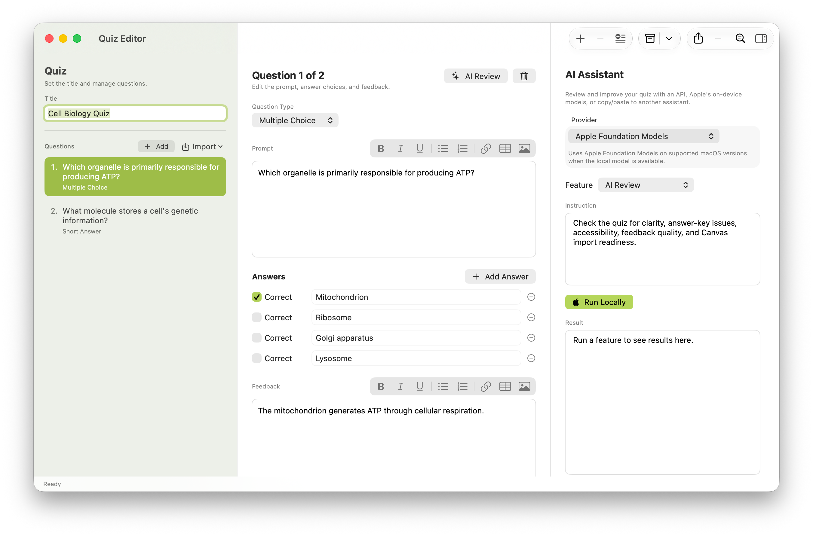
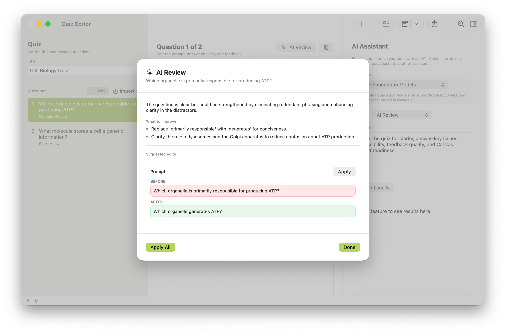
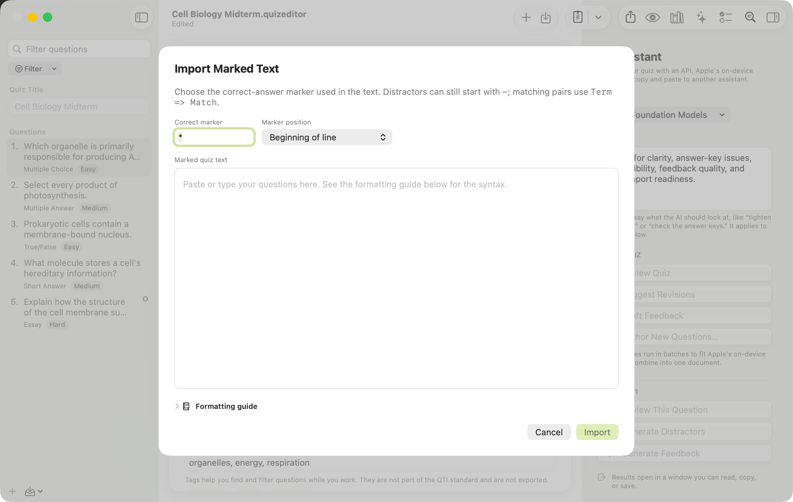

# Quiz Editor


A native macOS app for authoring, reviewing, and round-tripping quizzes in open interoperability standards — **QTI** (1.2 and 2.1) and **IMS Common Cartridge** — so they import and export across **Canvas, Brightspace, Blackboard, Moodle, and other learning management systems** that support those formats. Write questions with rich text and images, get AI-assisted item-writing feedback, tune the checks and AI to your discipline with a **persona**, and keep accessibility built in from the start.

> Built entirely on Apple frameworks (SwiftUI, AppKit, WebKit). No third-party dependencies.



## Features

- **Question editing** — multiple choice, multiple answer, true/false, fill-in-the-blank, short answer, essay, matching, and **numeric** (graded by an exact value with a tolerance, a range, or a number of significant figures, with an optional advisory expected unit).
- **Rich text (WYSIWYG)** — bold, italics, underline, lists, links, tables, and embedded images for prompts and feedback. Formatting round-trips through QTI.
- **Question metadata** — per-question **tags**, **difficulty** (easy/medium/hard), and **points**. Tags and difficulty persist in the document and ride along in the exported QTI item metadata.
- **Organize a long quiz** — a live **sidebar search**, **filter by tag or difficulty**, **drag-to-reorder** (with accessible Move Up/Down commands), **duplicate**, and a **quick-switch palette** (⌘⇧O) to jump to any question.
- **Offline quality linter** — instant, rule-based item-writing checks (no network): missing/duplicate correct answers, "all of the above," unemphasized negative stems, length-bias cues, empty/duplicate options, missing feedback, and a/an grammatical cues. Inline in the editor, a per-question status dot in the sidebar (filled for a warning, hollow for a suggestion, so severity is never color alone), and a quiz-wide **Quality Check** summary.
- **Discipline personas** — pick your field and the editor tunes itself to that discipline's item-writing practices across the whole app at once: the offline linter adds **field-specific rules** (a nursing "select all that apply" count cue, a chemistry answer missing its units, a stigmatizing term where person-first language belongs), the AI follows your field's **voice, distractor strategy, and terminology**, and the persona suggests the **question types and competency framework** your field leans on. Twenty-one personas ship built in across five families (Health, Natural sciences, STEM, Social sciences, Humanities). Every persona is **editable and forkable** in a guided editor (no JSON) and **shareable as a single file** — the built-ins are a starting point, not a cage. Persona suggestions are advisory and never block editing or change an export; accessibility rules stay on regardless of persona.
- **Link the whole item** — tie a question to the **learning objectives** it assesses, the **sources** it draws on, and a reusable **stimulus** (a case, scenario, or passage written once and shared across questions). The linter can flag unlinked items as a suggestion. Links are author metadata and never appear in exported QTI/Common Cartridge.
- **Competency frameworks & coverage** — map questions to a competency framework (built-in or your own) and get a **coverage report** showing which competencies are well covered and which have gaps, so a quiz can be checked against what it's meant to assess.
- **Misconception tagging** — label each distractor with the specific misconception it represents, so wrong answers carry diagnostic meaning. Like other author metadata, these tags stay in the document and are never exported.
- **Accessible by design** — alt text is *required* on images before export; VoiceOver labels, Dynamic Type, full keyboard operation, and color that is never the sole signal.
- **AI assistant** — the assistant panel offers clearly labeled tools for the **whole quiz** (review, suggest revisions, draft feedback, launch *Author with AI*) and for the **selected question** (review, generate distractors, generate feedback), all driven by an editable instruction you control. Per-question review runs against established item-writing guidelines (not just grammar), with a before/after diff and per-field "apply." Works with an OpenAI-compatible API, Apple Foundation Models, or copy/paste to another assistant. On Apple Foundation Models, a long quiz is paged into batches that fit the on-device token limit and stitched back into one document.
- **Document-based** — quizzes are native `.quizeditor` documents (JSON). Open with ⌘O or by double-clicking in Finder; New (⌘N), Save (⌘S), Save As, rename, and autosave/versions all work as expected. Structural edits (import, merge, reorder, duplicate, delete) are undoable.
- **Import** — **QTI** `.zip` packages (both per-file and single-file inline layouts) and **IMS Common Cartridge** (`.imscc`) exports — pulling in whole quizzes *and* item banks — plus simple marked plain text. A **question picker** (search, select all/none, preview, source labels) lets you import only the questions you want, with a *keep formatting* or *plain text* option for messy sources.
- **Merge & question bank** — **Merge from File…** appends questions from other `.quizeditor` or QTI/Common Cartridge files, flagging duplicates by prompt + type. The **Question Bank** browser indexes every `.quizeditor` file in a folder (read-only) so you can search across all of them and add what you need to the open quiz.
- **Export** — **QTI** packages as `.zip` in two profiles — **QTI 1.2** and **QTI 2.1** (the profiles Canvas labels *Classic* and *New Quizzes*, also accepted by Brightspace, Blackboard, Moodle, and other LMSs) — plus a formatted **HTML document** and a print-ready **paper exam** for testing centers (header fields, per-question points, type-appropriate answer affordances, page-break-safe layout, and a separate instructor answer key).
- **Validated export** — before writing a QTI package, Quiz Editor checks it is well-formed XML, internally consistent (manifest ↔ item files), and that it **re-imports to the same questions**. Any problems are shown so you can fix them or export anyway.
- **Preview** — a modal that renders a formatted version of the current question or the full quiz, with an optional answer key.

### AI review with a before/after diff



### Import marked plain text

The import field starts empty with a placeholder and a collapsible **formatting guide** (syntax plus a worked example), so the sample text can never be imported by accident.



## Keyboard shortcuts

Most actions live in the **Question** menu and have tooltips in the UI.

| Shortcut | Action |
|---|---|
| ⇧⌘N | Add question |
| ⌥⌘↑ / ⌥⌘↓ | Previous / next question |
| Home / End | First / last question |
| ⌘⇧O | Go to question… (quick-switch) |
| ⌃⌘↑ / ⌃⌘↓ | Move question up / down |
| ⌘D | Duplicate question |
| ⇧⌘I | Import marked text |
| ⇧⌘P | Preview |
| ⌥⌘A | Toggle the AI Assistant panel |

## Requirements

- macOS 14 (Sonoma) or later
- Swift 6 toolchain / Xcode 16+ (to build)

## Build & run

```sh
git clone https://github.com/ntderosu-code/QuizEditor.git
cd QuizEditor
swift run QuizEditorApp
```

Run the tests:

```sh
swift test
```

## Project layout

| Path | Purpose |
|---|---|
| `Sources/QuizEditorCore` | Models, QTI/Common Cartridge import/export, the offline linter, persona engine, linking and competency-framework models, AI prompt building, HTML utilities |
| `Sources/QuizEditorApp` | SwiftUI app (editor, sidebar, AI panel) |
| `Tests/QuizEditorCoreTests` | Unit tests for import/export, HTML handling, and AI parsing |

## AI configuration

The AI review, authoring, distractor, and feedback features support three providers:

- **OpenAI-compatible API** — supply an endpoint, model, and API key (stored locally via `@AppStorage`).
- **Apple Foundation Models** — on-device, on supported macOS versions with Apple Intelligence enabled. Quiz-level tools page long quizzes into batches that fit the on-device token limit and combine the results into one document.
- **Copy/Paste** — copies a prepared prompt for use in Claude, ChatGPT, or another assistant.

API keys are stored on your machine and are only sent to the endpoint you configure.

## App icon

The icon is a bubble sheet / scantron, designed for Apple's **Icon Composer** (Liquid Glass). The editable source is `AppIcon.icon/`; the rendered `Resources/AppIcon.icns` is bundled into the app by `Scripts/run-macos-app.sh`.

To regenerate the artwork and renditions:

```sh
# 1. Redraw the layer art (CoreGraphics)
swift Scripts/generate-icon.swift /tmp/iconwork
cp /tmp/iconwork/layer-foreground-1024.png AppIcon.icon/Assets/foreground.png

# 2. Render renditions from the .icon with Icon Composer's CLI (ictool)
ICT="/Applications/Xcode.app/Contents/Applications/Icon Composer.app/Contents/Executables/ictool"
"$ICT" AppIcon.icon --export-image --output-file icon-1024.png \
  --platform macOS --rendition Default --width 512 --height 512 --scale 2
```

Open `AppIcon.icon` in Icon Composer to tweak layers, gradient, and glass.

## Accessibility

WCAG 2.1 AA is treated as the floor. Images cannot be exported without alt text (or an explicit "decorative" choice), every control is keyboard reachable with visible focus, and status changes are announced to VoiceOver.

## License

[MIT](LICENSE) © 2026 Byron R Roush

Third-party acknowledgements are listed in the app under **Help → Acknowledgements**.
